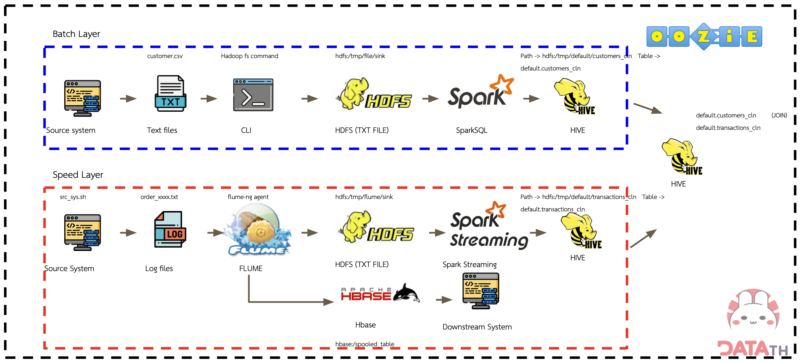

# Data Engineering Project: Coffee Shop Data Pipeline with Hadoop
This project is from [Road to Data Engineer](https://school.datath.com/courses/road-to-data-engineer-2-0-2023) course. Road to Data Engineer is a course that provides fundamental to advanced knowledge in the Data Engineer track. We can apply this knowledge to build automated data pipelines.

## Project Overview
This project aims to create a data pipeline for a coffee shop using Hadoop ecosystem to process and calculate daily member card points for running campaigns and promotions. It also intends to send real-time data when a customer places an order, allowing the back office system to quickly check the latest order.

### Hadoop System Design

- Batch Layer: Handles offline data processing tasks, typically for historical customer data in this project.
- Speed Layer: Deals with real-time data processing, handling transaction data when a customer places an order.

## Batch Layer Workflow
### Data Collection
- Source System: Text files are generated in form of csv (customer.csv).
- CLI: The Hadoop command-line interface (CLI) is used to interact with the system.
- HDFS: Text files is stored in the Hadoop Distributed File System (HDFS).

### Data Processing
- SparkSQL: Data is loaded into SparkSQL for data cleansing.
- HIVE: Data is transformed and queried using Hive which is a data warehousing infrastructure built on top of Hadoop.

### Output
- Tables: Customer data is stored in Hive tables for further analysis or reporting.

## Speed Layer Workflow

## Getting Start
### Seting-up Google Compute Engine (Optional)

